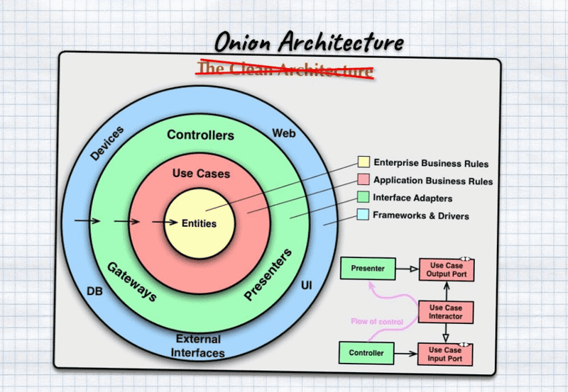
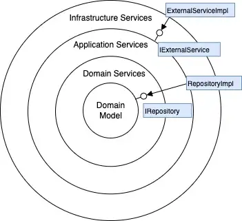

# ApiBoilerplate

## Features

- NestJs v9.x 🥳
- Typescript 🚀
- Production ready 🔥
- Swagger included
- Authentication and authorization (`JWT`, `API Key`) 💪
- Role management system
- Storage integration with `AwsS3`
- Upload file `single` and `multipart` to AwsS3
- Support multi-language `i18n` 🗣
- Request validation with `class-validation`
- Serialization with `class-transformer`
- Url Versioning
- Server Side Pagination, there have 3 of types
- Import and export data with excel by using `decorator`

## Database

- MongoDB integrate by using [mongoose][ref-mongoose] 🎉
- Database Transaction
- Database Soft Delete
- Database Migration

### Logger and Debugger

- Logger `Morgan` and Debugger `Winston` 📝

### Security

- Apply `helmet`, `cors`, and `rate-limit`
- Timeout awareness and can override ⌛️
- User agent awareness, and can whitelist user agent

### Setting

- Support environment file
- Centralize configuration 🤖
- Centralize response
- Centralize exception filter
- Setting from database 🗿
- TODO:
  Maintenance mode on / off from database 🐤

### Others

- Linter with EsLint for Typescript

### Todos:

- [ ] Create a seprate lib for the aws Ex: s3 related work, SQS etc.
- [ ] Husky GitHook For Check Source Code, and Run Test Before Commit 🐶
- [ ] Support CI/CD with Github Action or Jenkins
- [ ] Support Docker Installation
- [ ]

## Project Architecure

Onion architecture is built on a domain model in which layers are connected through interfaces. The idea is to keep external dependencies as far outward as possible where domain entities and business rules form the core part of the architecture. It provides flexible, sustainable and portable architecture.

- It provides flexible, sustainable and portable architecture.
- Layers are not tightly coupled and have a separation of concerns.
- It provides better maintainability as all the code depends on deeper layers or the centre.
- Improves overall code testability as unit tests can be created for separate layers without impacting other modules.
- Frameworks/technologies can be easily changed without impacting the core domain. e.g. RabbitMQ can be replaced by ActiveMQ, SQL can be replaced by MongoDB

### Principles

**Onion Architecture** is comprised of multiple concentric layers interfacing with each other towards the core that represents the domain. It is based on the inversion of control principle. The architecture does not focus on underlying technology or frameworks but the actual domain models. It is based on the following principles.

### Dependency

The circles represent different layers of responsibility. In general, the deeper we dive, the closer we get to the domain and business rules. The outer circles represent mechanisms and the inner circles represent core domain logic. The outer layers depend on inner layers and the inner layers are completely unaware of outer circles. Classes, methods, variables, and source code in general belonging to the outer circle depends on the inner circle but not vice versa.

### Data encapsulation

Each layer/circle encapsulates or hides internal implementation details and exposes an interface to the outer layer. All layers also need to provide information that is conveniently consumed by inner layers. **The goal is to minimize coupling between layers and maximize coupling within a vertical slice across layers**. We define abstract interfaces at deeper layers and provide their concrete implementation at the outermost layer. This ensures we focus on the domain model without worrying too much about implementation details.

### Separation of concerns

Application is divided into layers where each layer has a set of responsibilities and addresses separate concerns. Each layer acts as modules/package/namespace within the application.

### Coupling

Low coupling in which one module interacts with another module and does not need to be concerned with the other module’s internals. All the internal layers need not be concerned about internal implementation of external layers.

## Nx Helper commands

### Generate an application

Run `ng g @nrwl/angular:app my-app` to generate an application.

> You can use any of the plugins above to generate applications as well.

When using Nx, you can create multiple applications and libraries in the same workspace.

### Generate a library

Run `ng g @nrwl/angular:lib my-lib` to generate a library.

> You can also use any of the plugins above to generate libraries as well.

Libraries are shareable across libraries and applications. They can be imported from `@saas-starter-kit/mylib`.

### Development server

Run `ng serve my-app` for a dev server. Navigate to http://localhost:4200/. The app will automatically reload if you change any of the source files.

### Code scaffolding

Run `ng g component my-component --project=my-app` to generate a new component.

### Build

Run `ng build my-app` to build the project. The build artifacts will be stored in the `dist/` directory. Use the `--prod` flag for a production build.

### Running unit tests

Run `ng test my-app` to execute the unit tests via [Jest](https://jestjs.io).

Run `nx affected:test` to execute the unit tests affected by a change.

### Running end-to-end tests

Run `ng e2e my-app` to execute the end-to-end tests via [Cypress](https://www.cypress.io).

Run `nx affected:e2e` to execute the end-to-end tests affected by a change.

### Understand your workspace

Run `nx graph` to see a diagram of the dependencies of your projects.

### Nx create generator

Run `npx nx generate @nrwl/workspace:lib --name=markdown`
